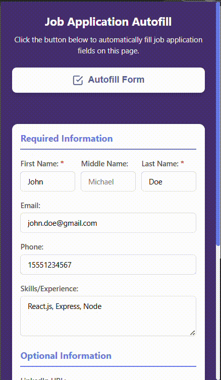
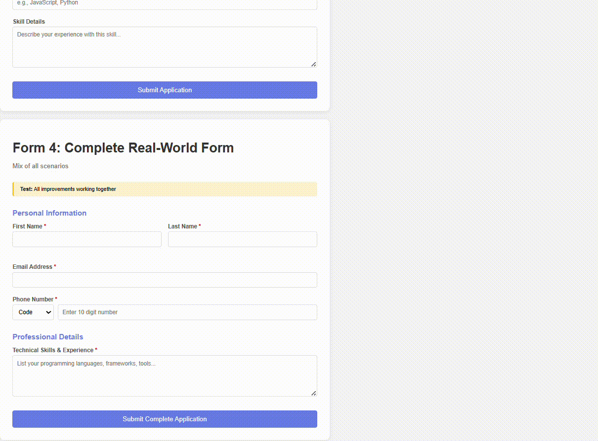

# Job Application Autofill - Chrome Extension

A professional Chrome extension (Manifest V3) that automatically fills job application forms with one click. Save time on repetitive data entry with intelligent form field detection and comprehensive autofill support.

## 🎥 Demo

### Extension Setup & Configuration
See how to install and configure the extension with your information:



### Autofill in Action
Watch the extension automatically fill job application forms:



## 📋 Extension Overview

This Chrome extension streamlines the job application process by automatically filling common form fields with your saved information. Built with Manifest V3, it features smart field detection that handles various form layouts including split name fields, phone number formats, and confirmation fields.

**Key Capabilities:**
- **Intelligent Field Detection**: Recognizes 14+ different field types across various form layouts
- **Split Field Support**: Handles separate first/middle/last name fields and split phone numbers
- **Phone Format Handling**: Automatically extracts 10-digit numbers from international formats
- **Confirmation Fields**: Auto-fills email and phone confirmation fields
- **Character Limits**: Respects field length restrictions with smart truncation
- **Professional URLs**: Supports LinkedIn, GitHub, and portfolio links
- **Persistent Storage**: Securely saves your information using Chrome's sync storage

## Features

- **One-Click Autofill**: Fill entire forms with a single button click
- **Smart Field Detection**: Automatically detects and fills:
  - First Name, Middle Name, Last Name (separate or combined)
  - Full Name
  - Email Address and Email Confirmation
  - Phone Number (10-digit format)
  - Country Code (separate field support)
  - Phone Confirmation
  - Skills / Experience
  - LinkedIn URL
  - GitHub URL
  - Portfolio / Website URL
  - City / Location
- **Flexible Name Handling**: Enter first, middle, and last names separately for accurate field mapping
- **Phone Number Intelligence**: Automatically strips country codes for 10-digit phone fields
- **Visual Feedback**: Green highlighting shows successfully filled fields
- **Clean, Modern UI**: Professional popup interface with organized field layout

## Setup & Installation

### Prerequisites
- Google Chrome browser (version 88 or higher)
- Basic understanding of Chrome extensions (for development)

### Installation Steps

1. **Download the Extension**
   ```bash
   # Clone from repository (if available)
   git clone https://github.com/yourusername/job-autofill-extension.git
   cd job-autofill-extension
   
   # Or download and extract the ZIP file
   ```

2. **Open Chrome Extensions Page**
   - Open Google Chrome
   - Navigate to `chrome://extensions/`
   - Or use menu: ⋮ (three dots) → Extensions → Manage Extensions

3. **Enable Developer Mode**
   - Toggle the **Developer mode** switch in the top-right corner

4. **Load the Extension**
   - Click the **Load unpacked** button
   - Navigate to and select the `zobsai` folder containing the extension files
   - The extension should now appear in your extensions list

5. **Verify Installation**
   - Look for the extension icon in your Chrome toolbar
   - If not visible, click the puzzle piece icon and pin the extension
   - Extension is ready to use!

### Troubleshooting Installation
- **Extension not loading**: Ensure all files (manifest.json, popup.html, popup.js, content.js, styles.css) are in the folder
- **Errors shown**: Check the browser console for specific error messages
- **Icon not showing**: Click the Extensions puzzle icon and pin the extension

## How to Use the Extension

### First-Time Setup

1. **Click the Extension Icon** 
   - Find the extension icon in your Chrome toolbar
   - Click it to open the popup window

2. **Enter Your Information**
   
   **Required Fields:**
   - **First Name**: Your first name (e.g., "John")
   - **Last Name**: Your last name (e.g., "Doe")
   
   **Recommended Fields:**
   - **Middle Name**: Your middle name or initial (optional, e.g., "M")
   - **Email**: Your email address (e.g., "john.doe@example.com")
   - **Phone**: Your phone number (e.g., "+1 234-567-8900" or "2345678900")
   - **Skills/Experience**: Your skills (e.g., "JavaScript, React, Node.js")
   
   **Optional Fields:**
   - **LinkedIn URL**: Your LinkedIn profile (e.g., "https://linkedin.com/in/johndoe")
   - **GitHub URL**: Your GitHub profile (e.g., "https://github.com/johndoe")
   - **Portfolio/Website**: Your portfolio or personal website
   - **City**: Your city or location (e.g., "San Francisco")

3. **Save Your Settings**
   - Click the **"Save Settings"** button
   - You'll see a success message confirming your data was saved
   - Your information is stored securely in Chrome and syncs across devices

### Autofilling Job Application Forms

1. **Navigate to a Job Application Page**
   - Open any job application form (LinkedIn, Indeed, company career pages, etc.)
   - The form should be visible on the page

2. **Open the Extension**
   - Click the extension icon in your toolbar
   - The popup will show your saved information

3. **Click "Autofill Form"**
   - Click the **Autofill Form** button in the popup
   - Watch as the extension automatically fills detected fields
   - Filled fields will briefly highlight in green
   - A success message shows how many fields were filled

4. **Review and Submit**
   - Review the auto-filled information for accuracy
   - Manually fill any fields the extension couldn't detect
   - Submit your application

### Tips for Best Results

- **Phone Format**: You can enter phone numbers in any format (+1 234-567-8900, 2345678900, etc.)
  - Extension automatically extracts 10-digit numbers for phone fields
  - Country codes are handled separately if the form has a country code field

- **Name Fields**: 
  - Forms with separate first/last name fields will use your individual name entries
  - Forms with a single "Full Name" field will combine: First + Middle + Last

- **Update Anytime**: You can update your saved information by opening the popup and clicking "Save Settings" again

- **Multiple Forms**: After saving once, you can use the extension on unlimited job applications

- **Page Refresh**: If the extension doesn't work, try refreshing the page and clicking "Autofill Form" again

## 🛠️ Technical Details

### Tech Stack

- **JavaScript (ES6+)**: Core functionality with modern syntax
- **Chrome Extensions API (Manifest V3)**: Latest extension framework
- **HTML5 & CSS3**: Modern, responsive user interface
- **Chrome Storage Sync API**: Cross-device data synchronization

### Architecture

**Extension Components:**
1. **manifest.json**: Extension configuration and permissions
2. **popup.html/js**: User interface and settings management
3. **content.js**: Form detection and autofill logic
4. **styles.css**: Professional popup styling

**Field Detection Strategy:**
- Multiple selector patterns per field type (name, id, placeholder, aria-label, autocomplete)
- Negative pattern exclusion to avoid false positives
- Visibility checking to skip hidden fields
- Priority-based filling for optimal results

**Data Flow:**
1. User enters data in popup → Saved to Chrome storage
2. User clicks "Autofill" → Popup sends message to content script
3. Content script detects fields → Fills with saved data
4. Visual feedback → Success message returned to popup

### Project Structure

```
zobsai/
├── manifest.json              # Manifest V3 configuration
├── popup.html                 # Popup UI structure
├── popup.js                   # Popup logic (120 lines)
├── content.js                 # Field detection & autofill (440 lines)
├── styles.css                 # Popup styling
├── icons/                     # Extension icons
│   ├── icon16.png
│   ├── icon48.png
│   └── icon128.png
├── test-form.html             # Basic test form
├── test-form-advanced.html    # Split field testing
├── test-edge-cases.html       # Comprehensive test suite
├── test-phone-extraction.html # Phone format testing
└── README.md                  # Documentation
```

### Supported Field Types

| Field Type | Detection Patterns | Notes |
|------------|-------------------|-------|
| First Name | firstname, fname, given-name | Separate field |
| Middle Name | middlename, mname, additional-name | Optional |
| Last Name | lastname, lname, surname, family-name | Separate field |
| Full Name | fullname, name (not first/last) | Combined field |
| Email | type="email", email | Primary email |
| Email Confirm | confirm email, verify email | Matches primary |
| Phone | type="tel", phone, mobile | 10-digit format |
| Phone Confirm | confirm phone, verify phone | Matches primary |
| Country Code | countrycode, country code | Separate selector |
| Skills | skills, experience | Textarea support |
| LinkedIn | linkedin, social | URL validation |
| GitHub | github, social | URL validation |
| Portfolio | portfolio, website, personal site | URL validation |
| City | city, location | Location field |

## 🧪 Testing

The extension includes comprehensive test file for validation:

### Test File Included

1. **test-form.html** - Split field testing
   - Separate first/middle/last name fields
   - Split phone number fields (country code + number)
   - Tests advanced field detection


### Testing Workflow

1. Open any test file in Chrome
2. Click the extension icon and fill in your information
3. Click "Autofill Form"
4. Verify all fields are filled correctly
5. Check that filled fields highlight in green

### Real-World Testing Sites

Test the extension on actual job portals:
- **LinkedIn**: Easy Apply forms
- **Indeed**: Job application forms
- **Glassdoor**: Application forms  
- **Company Career Pages**: Google, Microsoft, Amazon, etc.

## 🔒 Privacy & Security

- **Local Storage Only**: All data stored locally using Chrome's sync storage
- **No External Servers**: No data transmitted to external servers
- **No Tracking**: No analytics or user tracking
- **Secure Permissions**: Only accesses active tab when autofill is triggered
- **Open Source**: Fully transparent and auditable code
- **Sync Encryption**: Chrome automatically encrypts synced data

## ⚠️ Known Limitations

- May not work on dynamic forms loaded via JavaScript frameworks (React, Vue, etc.)
- Some sites with Content Security Policies may block the extension
- Custom or obfuscated form fields may not be detected
- Shadow DOM elements are not currently supported
- Multi-step form wizards may require clicking autofill on each step

## 🚀 Future Enhancements

Potential improvements for future versions:

- [ ] Support for dynamic/AJAX-loaded forms
- [ ] Multiple profile support (Personal, Professional, Freelance)
- [ ] Custom field mapping interface
- [ ] Import/Export settings (JSON format)
- [ ] Keyboard shortcuts (Ctrl+Shift+A to autofill)
- [ ] Dark mode theme
- [ ] Field preview before autofill
- [ ] Support for file uploads (resume PDF)
- [ ] Salary expectations field
- [ ] Full address support (street, city, state, ZIP)
- [ ] Date fields (availability, graduation date)
- [ ] Shadow DOM support
- [ ] Multi-step form detection

## 🤝 Contributing

Contributions, issues, and feature requests are welcome!

### How to Contribute

1. Fork the repository
2. Create your feature branch (`git checkout -b feature/AmazingFeature`)
3. Make your changes and test thoroughly
4. Commit your changes (`git commit -m 'Add some AmazingFeature'`)
5. Push to the branch (`git push origin feature/AmazingFeature`)
6. Open a Pull Request

### Development Setup

1. Clone the repository
2. Make your changes to the code
3. Load the extension in Chrome (`chrome://extensions/` → Load unpacked)
4. Test your changes using the provided test files
5. Check the console for errors

### Coding Guidelines

- Use ES6+ JavaScript syntax
- Keep functions focused and single-purpose
- Maintain clean, self-documenting code
- Test on multiple job application sites
- Ensure backward compatibility

## 📄 License

This project is licensed under the MIT License - see the LICENSE file for details.

## 👨‍💻 Author

**ZobsAI Job Application Autofill Extension**

Created as a professional Chrome extension demonstrating:
- Modern JavaScript (ES6+) development
- DOM manipulation and form handling
- Chrome Extension API (Manifest V3) integration
- Clean code architecture and best practices
- User experience design
- Edge case handling and validation

## 📞 Support & Troubleshooting

### Common Issues

**Extension not working:**
1. Refresh the page and try again
2. Check that you've saved your information
3. Verify extension is enabled in `chrome://extensions/`
4. Check browser console for errors

**Fields not filling:**
- Some forms use non-standard field names
- Try refreshing the page
- Ensure JavaScript is enabled
- Check if form is loaded dynamically

**Phone number issues:**
- Extension extracts 10-digit numbers automatically
- Enter your phone in any format (it will be normalized)
- Country code is handled separately if form has that field

**Data not saving:**
- Check Chrome storage permissions
- Ensure you clicked "Save Settings"
- Try disabling and re-enabling the extension

### Getting Help

- Check the test files for expected behavior
- Open browser DevTools to see console errors
- Verify the extension has necessary permissions
- Try reloading the extension

### Reporting Issues

When reporting issues, please include:
- Chrome version
- Error messages from console
- URL of the form (if public)
- Steps to reproduce the issue

---

**Built with ❤️ for job seekers everywhere. Happy job hunting! **
